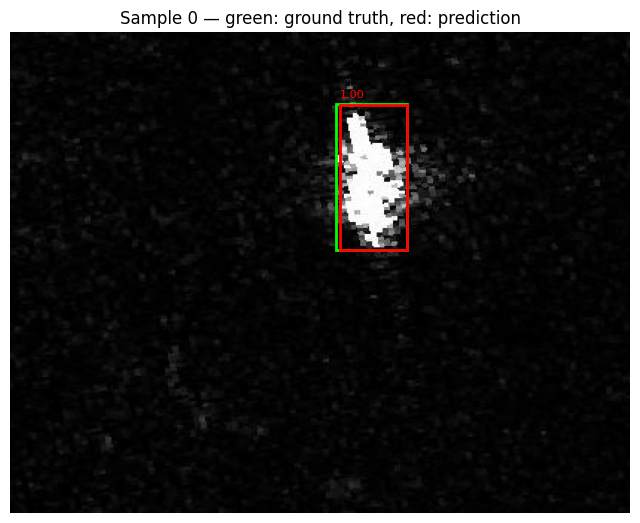
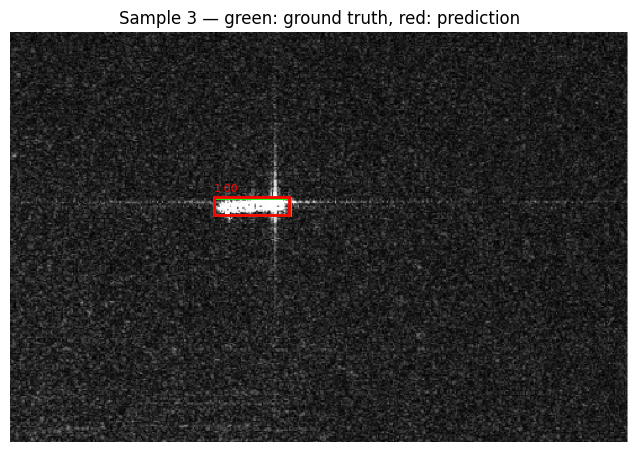

# SAR Ship Detector

[](https://colab.research.google.com/github/ehulle117/sar-ship-detector/blob/main/notebooks/02_train_colab.ipynb)

Fine-tuning a Faster R-CNN object detector (PyTorch/torchvision) to detect ships
in synthetic aperture radar (SAR) imagery, using the SSDD (SAR Ship Detection
Dataset).

## Motivation

Classical SAR analysis pipelines (thresholding, CFAR, manual annotation) are
the traditional approach to detecting objects in SAR imagery. This project
explores a learned alternative: fine-tuning a pretrained object detector on a
small, labeled SAR dataset, and honestly evaluating where it does and doesn't
outperform classical approaches.

## Dataset

[SSDD (SAR Ship Detection Dataset)](https://github.com/TianwenZhang0825/Official-SSDD)
— ~1,160 SAR image chips, ~2,540 labeled ship instances, VOC-style bounding
box annotations. Not included in this repo; see `data/README.md` for download
instructions.

## Project structure

```
src/
  dataset.py     - PyTorch Dataset for loading SSDD images + boxes
  model.py       - model construction (pretrained Faster R-CNN, 1-class head)
  train.py       - training loop
  evaluate.py    - mAP / precision / recall evaluation
  visualize.py   - draw predicted vs ground-truth boxes on sample images
notebooks/
  01_explore_data.ipynb   - sanity-check dataset and visualize labels
data/            - dataset lives here (gitignored)
outputs/         - checkpoints, metrics, sample prediction images (gitignored)
```

## Status

- [x] Phase 1: Data loading + visualization
- [x] Phase 2: Baseline training run
- [x] Phase 3: Evaluation (precision/recall, failure case review)
- [ ] Phase 4: Writeup + polish

## Results

Baseline: Faster R-CNN (ResNet-50 FPN backbone, COCO-pretrained), fine-tuned
10 epochs on SSDD, batch size 4, SGD lr=0.005. Trained on a Colab T4 GPU
(~2 min/epoch).

Evaluated on a held-out 15% val split (174 images), IoU >= 0.5, score >= 0.5:

| Metric | Value |
|---|---|
| Precision | 0.986 |
| Recall | 0.986 |
| TP / FP / FN | 420 / 6 / 6 |

Sample predictions (red = predicted box + confidence, green = ground truth):

<p align="center">
  
  
</p>

### Limitations / honest caveats

- **Train/val split wasn't fixed-seed for this checkpoint.** `train.py`
  originally split the dataset with an unseeded `random_split`, so this
  checkpoint's actual training run doesn't have a reproducible record of
  which 174 images were held out. I added a fixed seed (`torch.Generator()
  .manual_seed(42)`) to both `train.py` and `evaluate.py` after the fact so
  the *evaluation* script's val split is deterministic and reproducible --
  but for this specific checkpoint, that split may not be perfectly disjoint
  from what the model actually trained on, since the original run used a
  different (unseeded) split. Retraining with the current code would produce
  a checkpoint with a verifiably clean held-out set.
- **Small dataset, single class.** SSDD is ~1,160 chips, one class (ship),
  mostly clean single-ship-per-image scenes. High precision/recall here
  doesn't say much about performance on harder cases -- dense harbor scenes,
  small/faint targets, or land clutter false positives -- since SSDD is
  curated to already exclude a lot of that difficulty.
- **No hyperparameter tuning.** This is a first-pass baseline (default LR,
  no LR schedule, no augmentation). Numbers are a starting point, not a
  ceiling.

### Next steps if continuing this project

- Retrain with the fixed seed for a verifiably clean val split
- Add data augmentation (flips, rotations -- SAR imagery has no canonical
  "up") and see if it helps generalization
- Try a harder/larger dataset (e.g. xView) or SSDD's inshore-only subset,
  which is known to be more difficult than the full set
- Add a proper mAP@[0.5:0.95] metric instead of single-threshold precision/recall

## Setup

```bash
python -m venv .venv
source .venv/bin/activate
pip install -r requirements.txt
```

Designed to run on Google Colab's free GPU tier if you don't have local CUDA.
